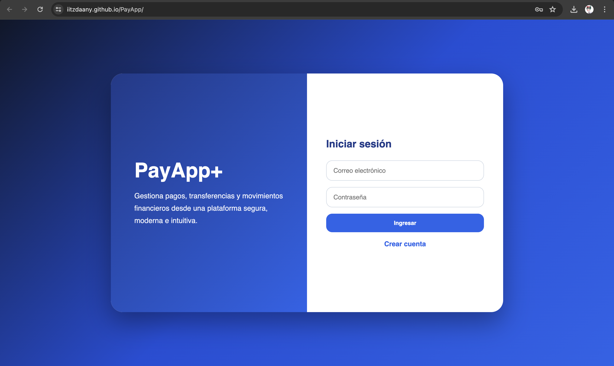
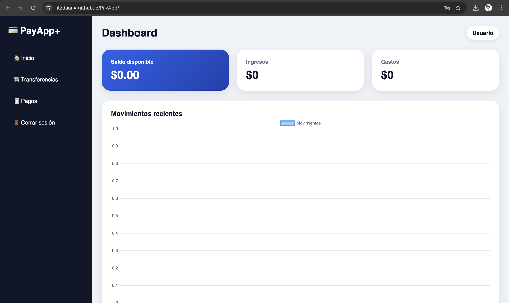
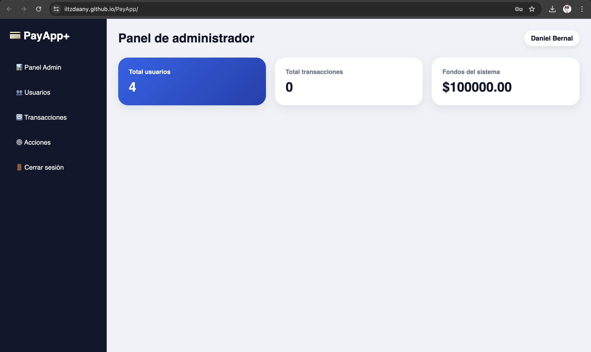

# PayApp+

Aplicación web de gestión financiera que permite registrar usuarios, consultar saldos, realizar transferencias, pagar servicios y visualizar movimientos. También incluye un panel administrativo para consultar usuarios y transacciones, asignar saldo, bloquear cuentas y modificar roles.

> Proyecto académico desarrollado con Node.js, Express y PostgreSQL. La interfaz está construida con HTML, CSS y JavaScript puro.

## Capturas de pantalla

### Inicio de sesión



### Dashboard de usuario



### Panel de administrador



## Funcionalidades

### Usuarios

- Registro de clientes.
- Inicio de sesión con correo y contraseña.
- Contraseñas cifradas con `bcrypt`.
- Autenticación mediante JSON Web Token (JWT).
- Consulta del saldo disponible.
- Historial de movimientos enviados y recibidos.
- Resumen de ingresos y gastos.
- Gráfica de movimientos con Chart.js.

### Operaciones

- Transferencias entre cuentas.
- Validación de saldo suficiente.
- Validación de propiedad de la cuenta de origen.
- Prevención de transferencias hacia la misma cuenta.
- Pagos de servicios con referencia.
- Registro de operaciones en una tabla de auditoría.

### Administración

- Consulta general de usuarios.
- Consulta global de transacciones.
- Asignación de saldo a una cuenta.
- Bloqueo y desbloqueo de usuarios.
- Cambio de rol entre `cliente` y `admin`.

## Tecnologías utilizadas

| Capa | Tecnologías |
| --- | --- |
| Backend | Node.js, Express |
| Base de datos | PostgreSQL, Supabase |
| Acceso a datos | `pg` |
| Seguridad | JWT, `bcrypt`, variables de entorno |
| Frontend | HTML, CSS, JavaScript |
| Gráficas | Chart.js |
| Desarrollo | Nodemon |

## Estructura del proyecto

```text
PayApp/
├── config/
│   └── db.js
├── controllers/
│   ├── admin.controller.js
│   ├── auth.controller.js
│   ├── cuenta.controller.js
│   ├── dashboard.controller.js
│   ├── pago.controller.js
│   └── transaccion.controller.js
├── docs/
│   ├── index.html
│   └── style/
├── frontend/
│   ├── index.html
│   └── style/
├── middleware/
│   ├── admin.middleware.js
│   └── auth.middleware.js
├── routes/
│   ├── admin.routes.js
│   ├── auth.routes.js
│   ├── cuenta.routes.js
│   ├── dashboard.routes.js
│   ├── pago.routes.js
│   └── transaccion.routes.js
├── .env.example
├── .gitignore
├── PayApp.sql
├── package.json
└── server.js
```

## Requisitos previos

Instala las siguientes herramientas:

- Node.js.
- npm.
- PostgreSQL local o un proyecto de Supabase.
- Git.

## Instalación

Clona el repositorio:

```bash
git clone https://github.com/iiTzDaany/PayApp.git
cd PayApp
```

Instala las dependencias:

```bash
npm install
```

Crea el archivo de variables de entorno:

```bash
cp .env.example .env
```

En Windows CMD puedes usar:

```bat
copy .env.example .env
```

Configura las variables del archivo `.env`:

```env
PORT=3000
DB_HOST=tu_host_de_supabase
DB_PORT=5432
DB_USER=tu_usuario_de_supabase
DB_PASSWORD=tu_contraseña_de_supabase
DB_NAME=postgres
JWT_SECRET=coloca_una_clave_secreta_larga_aqui
```

No subas el archivo `.env` al repositorio. El proyecto ya lo excluye mediante `.gitignore`.

## Configuración de la base de datos

El archivo `PayApp.sql` crea las tablas, catálogos y datos iniciales. Incluye las siguientes entidades:

- `usuario`
- `cliente`
- `administrador`
- `cuenta`
- `tipo_transaccion`
- `estado_transaccion`
- `servicio`
- `transaccion`
- `pago`
- `auditoria`

También registra servicios de ejemplo: electricidad, internet, agua, telefonía y streaming.

### Supabase

Para utilizar Supabase:

1. Crea un proyecto en Supabase.
2. Abre el editor SQL.
3. Copia el contenido de `PayApp.sql`.
4. Omite la instrucción inicial:

```sql
CREATE DATABASE payapp;
```

5. Ejecuta el resto del script dentro de la base de datos `postgres`.
6. Copia las credenciales de conexión al archivo `.env`.

### PostgreSQL local

Para trabajar con PostgreSQL instalado en tu equipo:

```bash
createdb payapp
```

Comenta o elimina la línea `CREATE DATABASE payapp;` de `PayApp.sql` y ejecuta:

```bash
psql -d payapp -f PayApp.sql
```

Usa estas variables como referencia:

```env
PORT=3000
DB_HOST=localhost
DB_PORT=5432
DB_USER=postgres
DB_PASSWORD=tu_contraseña_local
DB_NAME=payapp
JWT_SECRET=coloca_una_clave_secreta_larga_aqui
```

> La configuración actual de `config/db.js` activa SSL para la conexión con Supabase. Si utilizas PostgreSQL local y el servidor no admite SSL, cambia temporalmente la propiedad `ssl` a `false` o agrega una configuración condicional para diferenciar ambos entornos.

## Ejecución del backend

Para desarrollo:

```bash
npm run dev
```

Para ejecución normal:

```bash
npm start
```

El servidor se inicia de forma predeterminada en:

```text
http://localhost:3000
```

Puedes verificar que la API está activa con:

```bash
curl http://localhost:3000/
```

Para comprobar la conexión con la base de datos:

```bash
curl http://localhost:3000/api/test-db
```

## Configuración del frontend

La interfaz se encuentra en:

```text
frontend/index.html
```

La carpeta `docs/` contiene una copia preparada para publicarse como sitio estático mediante GitHub Pages.

Antes de usar la interfaz, revisa la constante `API_URL` dentro de `frontend/index.html` y `docs/index.html`.

Para trabajar localmente:

```js
const API_URL = 'http://localhost:3000/api';
```

Para conectar la interfaz con el backend configurado en Render:

```js
const API_URL = 'https://payapp-backend-s2yo.onrender.com/api';
```

> Importante: las rutas del backend están registradas bajo el prefijo `/api`. Si `API_URL` no termina en `/api`, el frontend intentará consultar rutas inexistentes como `/auth/login` en lugar de `/api/auth/login`.

Para abrir la interfaz localmente puedes utilizar Live Server en Visual Studio Code o abrir el archivo `frontend/index.html` desde el navegador.

## Publicación del frontend con GitHub Pages

La carpeta `docs/` puede utilizarse como origen de publicación:

1. Entra a **Settings** en el repositorio.
2. Abre la sección **Pages**.
3. Selecciona **Deploy from a branch**.
4. Elige la rama `main`.
5. Selecciona la carpeta `/docs`.
6. Guarda los cambios.

## Autenticación

Las rutas protegidas requieren el token JWT en el encabezado `Authorization`.

Ejemplo:

```http
Authorization: TU_TOKEN_JWT
```

> El middleware actual espera directamente el token. No agregues el prefijo `Bearer` salvo que también ajustes `middleware/auth.middleware.js`.

## Endpoints principales

### Acceso público

| Método | Ruta | Descripción |
| --- | --- | --- |
| `GET` | `/` | Comprueba que la API está funcionando. |
| `GET` | `/api/test-db` | Prueba la conexión con PostgreSQL o Supabase. |
| `POST` | `/api/auth/register` | Registra un cliente y crea su cuenta de débito. |
| `POST` | `/api/auth/login` | Inicia sesión y devuelve un token JWT. |

### Usuario autenticado

| Método | Ruta | Descripción |
| --- | --- | --- |
| `GET` | `/api/cuentas` | Consulta las cuentas del usuario autenticado. |
| `GET` | `/api/transacciones` | Lista movimientos enviados y recibidos. |
| `POST` | `/api/transacciones` | Realiza una transferencia. |
| `GET` | `/api/dashboard` | Obtiene ingresos, gastos y movimientos agrupados por fecha. |
| `GET` | `/api/pagos/servicios` | Lista los servicios disponibles. |
| `POST` | `/api/pagos` | Registra el pago de un servicio. |

### Administrador

| Método | Ruta | Descripción |
| --- | --- | --- |
| `GET` | `/api/admin/usuarios` | Lista usuarios, cuentas y saldos. |
| `GET` | `/api/admin/transacciones` | Lista todas las transacciones del sistema. |
| `POST` | `/api/admin/asignar-saldo` | Agrega saldo a una cuenta. |
| `PUT` | `/api/admin/usuario/estado` | Cambia el estado de un usuario. |
| `PUT` | `/api/admin/usuario/rol` | Cambia el rol de un usuario. |

## Ejemplos de uso con `curl`

### Registrar un usuario

```bash
curl -X POST http://localhost:3000/api/auth/register \
  -H "Content-Type: application/json" \
  -d '{
    "nombre": "Usuario Demo",
    "correo": "demo@correo.com",
    "password": "ClaveSegura123"
  }'
```

### Iniciar sesión

```bash
curl -X POST http://localhost:3000/api/auth/login \
  -H "Content-Type: application/json" \
  -d '{
    "correo": "demo@correo.com",
    "password": "ClaveSegura123"
  }'
```

Copia el valor de `token` de la respuesta.

### Consultar cuentas

```bash
curl http://localhost:3000/api/cuentas \
  -H "Authorization: TU_TOKEN_JWT"
```

### Realizar una transferencia

```bash
curl -X POST http://localhost:3000/api/transacciones \
  -H "Content-Type: application/json" \
  -H "Authorization: TU_TOKEN_JWT" \
  -d '{
    "id_cuenta_origen": 2,
    "id_cuenta_destino": 3,
    "monto": 150,
    "descripcion": "Transferencia de prueba"
  }'
```

### Pagar un servicio

```bash
curl -X POST http://localhost:3000/api/pagos \
  -H "Content-Type: application/json" \
  -H "Authorization: TU_TOKEN_JWT" \
  -d '{
    "id_servicio": 1,
    "referencia": "RECIBO-123456",
    "monto": 250
  }'
```

## Modelo de datos resumido

```text
usuario
 ├── cliente
 ├── administrador
 └── cuenta
      ├── transaccion
      │    └── pago
      └── auditoria

transaccion
 ├── tipo_transaccion
 └── estado_transaccion

pago
 └── servicio
```

## Ajustes recomendados antes de producción

- Corregir `API_URL` para incluir `/api`.
- Eliminar la declaración duplicada de `GET /` en `server.js`.
- Configurar SSL de manera condicional para Supabase y PostgreSQL local.
- Cambiar las credenciales iniciales del administrador.
- Utilizar una clave `JWT_SECRET` extensa y privada.
- Agregar validación de entradas con una biblioteca especializada.
- Agregar pruebas automatizadas.
- Restringir CORS a los dominios autorizados.
- No utilizar este proyecto como sistema financiero real sin una revisión integral de seguridad.

## Scripts disponibles

| Comando | Descripción |
| --- | --- |
| `npm start` | Ejecuta `node server.js`. |
| `npm run dev` | Ejecuta el servidor con Nodemon. |

## Licencia

Este proyecto utiliza la licencia ISC definida en `package.json`.
